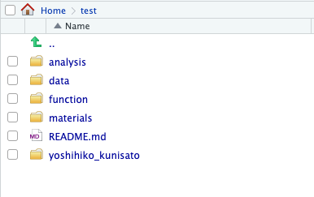

<!-- README.md is generated from README.Rmd. Please edit that file -->

```{r, include = FALSE}
knitr::opts_chunk$set(
  collapse = TRUE,
  comment = "#>",
  fig.path = "man/figures/README-",
  out.width = "100%"
)
```

# senshuRmd

<!-- badges: start -->
<!-- badges: end -->

senshuRmdは，専修大学人間科学部心理学科での卒業論文・修士論文をRmarkdownで作成するためのRパッケージです。使用にあたり，tinytexが必要です。

## インストール

以下のコマンドをRコンソールに打ち込んで，Github経由でインストールしてください。

``` 
# install.packages("devtools")
devtools::install_github("ykunisato/senshuRmd")
```

## 使用法
### 研究室用Research Compendiumの準備

#### 1.新規プロジェクトの作成

RStudioで新規プロジェクトを作成します(GitHubを使う場合は，version controlで作成)。

#### 2.新規プロジェクトフォルダ内で以下を実行します。

set_rc_ccp()内に，卒論や修論用Rmarkdownに付けたい名前をいれます（ローマ字で，名前_姓が無難かと思います）。そうすると，研究室用Research CompendiumのためのフォルダとREADMEファイルの作成と卒論・修論用RMarkdownのフォルダとファイルを作成します。

```
library(senshuRmd)
set_rc_ccp("yoshihiko_kunisato")
```

以下のような感じのフォルダ構成になります。



ご自身が名前を付けたフォルダに卒論や修論用Rmarkdownがはいっていますので，そちらを開いて，Knitをしてみてください。卒論・修論フォーマットのPDFが出力されるかと思います。


### 卒論・修論用RMarkdownの準備

上記のように，研究室用Research Compendiumは不要で，卒論・修論用RMarkdownだけがほしい場合は，RStudioで，「File」 -> 「New File」 -> 「R Markdown...」 をクリックする。以下の画面がでてきたら，「From Template」から「Thesis format for Senshu {senshuRmd}」を選んで，OKをクリックする。これで，卒論・修論用RMarkdownが準備されます。


## 日本語引用文献に関する注意事項

このRmdテンプレートでは，apa-6th-edition.cslを使ってAPA形式で出力します。英語文献はいい感じですが，日本語文献は位置も引用形式もちょっとおかしい感じになっています。このRmdテンプレートでは，TeXファイルが出力されるので，その出力されたファイルをいじって最終調整をして，以下をコンソールに打ち込むといい感じになります。

```{r eval=FALSE, include=TRUE}
library(tinytex)
xelatex('skeleton.tex')
```

