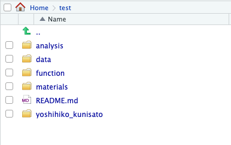

<!-- README.md is generated from README.Rmd. Please edit that file -->

# senshuRmd

<!-- badges: start -->

<!-- badges: end -->

senshuRmdは，専修大学人間科学部心理学科での卒業論文・修士論文をRmarkdownで作成するためのRパッケージです。使用にあたり，tinytexが必要です。

## インストール

以下のコマンドをRコンソールに打ち込んで，Github経由でインストールしてください。

    # install.packages("devtools")
    devtools::install_github("ykunisato/senshuRmd")

## 使用法

RStudioで，「File」 -\> 「New File」 -\> 「R Markdown…」
をクリックする。以下の画面がでてきたら，「From
Template」から「Thesis format for Senshu
{senshuRmd}」を選んで，OKをクリックする。



## メモ

以下を行うには，pandocのlatexテンプレート(<https://github.com/jgm/pandoc-templates/blob/master/default.latex>
)に手を加えたものをテンプレートファイルにする必要があります。

  - 表紙と目次で改ページする
  - geometryパッケージをxelatexで機能させて1頁を800字に調整する

### 表紙と目次で改ページする

`\begin{document}`の直後に`\pagestyle{empty}`をいれて，`\maketitle`の後に`\clearpage`を追加する。そして，目次が終わったら（`$body$`の前），以下の３つをいれて，改ページ，ページ番号ふるのを再開，ページ番号を１に戻すをする。

### 1頁を800字に調整

`\usepackage[$for(geometry)$$geometry$$sep$,$endfor$]{geometry}`をコメントアウトして，`\geometry{$for(geometry)$$geometry$$sep$,$endfor$}`を入れる(xelatexでは一度geometryを読み込んでいるので，二度読み込むことでエラーがでるらしい・・・)。

RmdのYAMLにて，以下を書くとマージンの指定ができる。12ptで以下の指定をすると，1頁あたり800字になる。

  - geometry: left = 3.5cm, right = 3.5cm, top = 4.5cm, bottom =
4.5cm

### 日本語引用文献

このRmdテンプレートでは，apa-6th-edition.cslを使ってAPA形式で出力する。英語文献はいい感じだが，日本語文献は位置も引用形式もちょっとおかしい感じになっているので，調整が必要になる。このRmdテンプレートでは，TeXファイルが出力されるので，その出力されたファイルをいじって最終調整をして，以下をコンソールに打ち込むといい感じになる。

``` r
library(tinytex)
xelatex('skeleton.tex')
```
