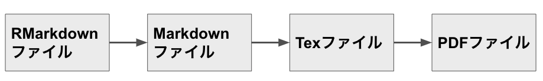

<!-- 
(1) このRmdテンプレートを使う際の注意事項
・この上の部分は，「タイトル」の変更と学籍番号・氏名の追加以外は絶対に変更しない。
　変更すると正常に動かなくなります。

・以下に色々と説明が書いてあるので，それにしたがって，書き足していってください。
　作業が進んだら，上の「Knit」を押すと，Rmd→TeX→PDFの変換が自動的になされます。
　このRmdテンプレートを用いた卒論執筆については，以下も参照ください。
　https://kunisatolab.github.io/main/how-to-write-with-rstudio.html

・この<!　 >で囲われた部分は，TeXやPDFには反映されないので，削除しなくても大丈夫です。
　削除しても問題はないので，邪魔になったら削除してもいいです。


(２) 卒論・修論全体の注意事項
1.パラグラフライティングを心がけてください。
　・１パラグラフで述べる主張は１つにしぼる。
　・１パラグラフは，最初に主張，そしてその主張を裏付ける複数の文から構成します。
　・段落を組み合わせることで,論理展開を行う(文を接続詞でつないで，論理展開しない）。
　
2.卒論や修論は，指導教員に向けて書くのではなく，
　その領域に詳しくない人にもわかるように書いてください。
　・前提となる知識を序文で説明する。
　・概念や方法の説明を丁寧にする。
　・略語を多用しない。

3.主語を意識して文章を書く。
　日本語は主語を省略することが多いので，主語が不明確だったり，
　場合によっては主語がブレることがあります。以下を注意ください。
　・今書いている文の主語は何かを意識してください。
　・特に自分の考えた主張なのか，他の研究者の主張なのかは確実に分けてください。
　・パラグラフや全体を通して，主語がぶれてないか注意ください
　　（よくあるのは，他の研究者の主張を書いていて，途中から自分の主張が混ざるとかです）。
-->


<!-- 
Rパッケージの読み込み
卒論で使用するRパケージは，すべてこちらで読み込む（他のチャンクでlibaryを使わない）
-->
```{r message=FALSE, warning=FALSE, include=FALSE}
library(kableExtra)
library(knitr)
library(tidyverse)
library(psych)
library(gridExtra)
library(jtools)
library(ggsignif)
```


<!-- 
<<< 序文で書くこと >>>
なぜこの研究を行うのか，その重要性を述べるのが序論(Introduction)です。
序論では，それを以下のような順番で書いていきます。
1.その研究領域全体における大きな問題点や事実の指摘
2.少し専門領域にしぼりこんだ上で，先行研究を整理する（何が既にわかっているか？）
3.先行研究の問題点の指摘（何が分かってないか？）
4.本研究での解決策の提案（先行研究で分かってないことをどう調べるか？）
5.本研究の目的
-->

# 序文
## はじめに

<!-- 
「はじめに」で，1.その研究領域全体における大きな問題点や事実の指摘をします。
臨床的問題の場合は，疫学的なデータや疾患による障害度など一般的な背景知識を提示しつつ，
多くの読者が知っている知識から始めて，段々と論点を絞ってください。 
-->


<!-- 
<<< 文献の引用について >>>
bibファイルが用意されていれば，参照名（ラベル）を使って，以下のように簡単に引用できます。
bibファイルの準備に関しては，以下を参照ください。
特に日本語文献は少しややこしい手続きをふむ必要があります。
https://kunisatolab.github.io/main/how-to-write-with-rstudio.html
-->

まず，@Kunisato2012 のように，すると，bibファイル内のKunisatoの2012年の論文が引用されます。そして，次のように，[]でくくると文末の引用スタイルになります[@kunisato2019]。また，文末に複数引用する場合は，こういう感じにします[@kunisato2019; @Machino2014]。

<!-- 以下は1頁が800字になっているかのチェック用です。
ご自身の環境でちゃんと1頁が800字になっているか確認をしてから，削除してください。-->
\clearpage
０１２３４５６７８９０１２３４５６７８９０１２３４５６７８９０１２３４５６７８９０１２３４５６７８９０１２３４５６７８９０１２３４５６７８９０１２３４５６７８９０１２３４５６７８９０１２３４５６７８９０１２３４５６７８９０１２３４５６７８９０１２３４５６７８９０１２３４５６７８９０１２３４５６７８９０１２３４５６７８９０１２３４５６７８９０１２３４５６７８９０１２３４５６７８９０１２３４５６７８９０１２３４５６７８９０１２３４５６７８９０１２３４５６７８９０１２３４５６７８９０１２３４５６７８９０１２３４５６７８９０１２３４５６７８９０１２３４５６７８９０１２３４５６７８９０１２３４５６７８９０１２３４５６７８９０１２３４５６７８９０１２３４５６７８９０１２３４５６７８９０１２３４５６７８９０１２３４５６７８９０１２３４５６７８９０１２３４５６７８９０１２３４５６７８９０１２３４５６７８９０１２３４５６７８９０１２３４５６７８９０１２３４５６７８９０１２３４５６７８９０１２３４５６７８９０１２３４５６７８９０１２３４５６７８９０１２３４５６７８９０１２３４５６７８９０１２３４５６７８９０１２３４５６７８９０１２３４５６７８９０１２３４５６７８９０１２３４５６７８９０１２３４５６７８９０１２３４５６７８９０１２３４５６７８９０１２３４５６７８９０１２３４５６７８９０１２３４５６７８９０１２３４５６７８９０１２３４５６７８９０１２３４５６７８９０１２３４５６７８９０１２３４５６７８９０１２３４５６７８９０１２３４５６７８９０１２３４５６７８９０１２３４５６７８９０１２３４５６７８９０１２３４５６７８９０１２３４５６７８９０１２３４５６７８９０１２３４５６７８９０１２３４５６７８９０１２３４５６７８９０１２３４５６７８９０１２３４５６７８９０１２３４５６７８９０１２３４５６７８９ここから八百字超えています。


## 先行研究について
<!-- ↑この見出しは，内容に合わせて変更ください-->
<!-- 
2.少し専門領域にしぼりこんだ上で，先行研究を整理する（何が既にわかっているか？）
・先行研究について概観して，どこまで分かっているのか述べてください。
・必要に応じて，扱う構成概念，方法などの定義や整理をしてください。
・最初に，一般的な問題から当該研究への移行を促す一文をいれるとスムーズです
（研究分野での問題解決には今回扱う内容が重要であることを示して移行すると良いです） ・先行研究レビューする順序は，以下の３つの順序があるので，適宜選択してください
(1)時系列：過去から並べていく
(2)方法/理論/モデル：方法，理論，方法などのカテゴリーごとにまとめる
(3)一般的な事象から個別の事象へと進める-->


### 先行研究での知見１
<!-- ↑この見出しは，内容に合わせて変更ください
以下に先行研究に関する見出しを以下に７つ用意していますが，
７つ以上でも以下でもかまいません。
内容に合わせて，数と見出名を変えてください。-->


### 先行研究での知見2
<!-- ↑この見出しは，内容に合わせて変更ください。-->


### 先行研究での知見3
<!-- ↑この見出しは，内容に合わせて変更ください。-->


### 先行研究での知見4
<!-- ↑この見出しは，内容に合わせて変更ください。-->


### 先行研究での知見5
<!-- ↑この見出しは，内容に合わせて変更ください。-->


### 先行研究での知見６
<!-- ↑この見出しは，内容に合わせて変更ください。-->


### 先行研究での知見７
<!-- ↑この見出しは，内容に合わせて変更ください。-->

## 先行研究の問題点
<!-- ↑この見出しは，内容に合わせて変更ください。
3.先行研究の問題点の指摘（何が分かってないか？）
・研究における未解決の問題について記載してください。ここが一番大切です。
・これまで概観してきた先攻研究では未解決な点について書いて，取り組もうとする問題を明確にしてください。
・何が分かってないのかだけでなく，それが分かるとどう役に立つのかについても述べてください 
4.本研究での解決策の提案（先行研究で分かってないことをどう調べるか？）
・3を書いた上で，パラグラフを分けて，本研究ではどのようにその問題を解決するのかを書いてください。
・解決法としては，(1)未検討部分を検討する，(2)方法の改善をする，
　(3)理論の拡張や限定をする，(4)モデルの改良をするなどがあります。
・この解決策の有効性と意義についても述べてください。
-->


# 目的
<!-- 本研究の目的について，仮説も含めて明確に述べてください -->

\clearpage 

# 方法

## 実験or調査参加者
<!-- ↑この見出しは，内容に合わせて変更ください-->

<!--　論文内の数値は手で打ち込まずにRから引っ張ってきてください。
例えば，以下では，Psychパッケージのbfiデータの数値をひっぱっています。
まず，rで性別と年齢のデータを用意して，用意したものを`r sprintf('%.0f',nrow(bfi))`という感じで，
挿入しています。これで，数値のコピペミスがなくなります-->

```{r include=FALSE}
# bfiデータを読み込み
data(bfi)
# bfiの性別(gender)をtableで集計して，データフレーム化，その後ワイド化して，変数名を変更
gender <- data.frame(table(bfi$gender)) %>% 
   tidyr::spread(Var1, Freq) %>% 
   rename(male=1,female = 2)
```

神奈川県内の私立大学生`r sprintf('%.0f',nrow(bfi))`名(男性`r sprintf('%.0f',gender$male)`名，女性`r sprintf('%.0f',gender$female)`名)が実験or調査に参加した。参加者の平均年齢 (標準偏差) は，`r sprintf('%.2f',mean(bfi$age))`歳(`r sprintf('%.2f',sd(bfi$age))`)であった。

<!--　もし，研究脱落者や調査において欠測値がある場合は，何名がデータから脱落し，
結果として何名を分析対象にしたか述べてください  -->


## 行動課題や質問紙
<!-- ↑この見出しは，内容に合わせて変更ください-->

<!-- 行動課題や質問紙について詳細に記述してください。
特に，行動課題は図も含めてかなり詳細に説明をしてください。
質問紙も作成過程や項目数，得点範囲，信頼性と妥当性の検討結果などを含めて詳細に記載してください。
行動課題も質問紙も付録に添付ください。-->


## 実験手続き（調査手続き）
<!-- ↑この見出しは，内容に合わせて変更ください-->

<!-- 実験について詳細に述べてください。
実験プロトコルを事前に作成している場合は，それを付録に添付してください。
調査についても，どのように調査を行ったのか詳細に記述してください。 -->


## 統計解析
<!-- 以下のようにするとsessionInfoから使用したRのバージョンとOS情報が抽出されるので，解析環境の情報を自動的に記録できます-->

　統計解析は，`r sprintf(sessionInfo()$running)`上で，`r sprintf(sessionInfo()$R.version$version.string)`を用いて実施された。使用されたRパッケージは以下の通りになる。

```{r echo=FALSE}
# 使用したRパッケージ名とバージョン情報を抽出して表を作る
packages_used <- as_tibble(sessioninfo::package_info()) %>%
   filter(attached==TRUE) %>% 
   select(package,loadedversion)

kable(packages_used, 
      format = "latex", 
      booktabs = T, 
      caption = "使用Rパッケージ",
      digits = 2,
      col.names = c("R packages","Version")) %>%
  kable_styling(latex_options = c("striped", "hold_position"),full_width = F) 
```

\clearpage

<!-- 
<<< 結果の書き方 >>>
解析計画に合わせて，何を明らかにする解析をしているのか書いてから，結果を書いてください。
結果から言えること（考察）は，結果に書かないようにしてください
（結果は序論と方法を受けて書くもので，結果には考察を書かない）。
-->
# 結果
## 記述統計
<!-- ↑この見出しは，内容に合わせて変更ください-->

<!--　得られたデータの平均値，標準偏差，得点範囲などの基本的な記述統計を記載してください。
また，ヒストグラムなどを使って，データの分布も示しましょう  -->

<!--　表は以下のようにすると綺麗に出力されます  -->
```{r echo=FALSE}
# bfiの各Big Five因子を合計して，describe関数で記述統計を計算する。不要なものは除外。
summary_bfi <- bfi %>% 
   mutate(Agreeableness = A1 + A2 + A3 + A4 + A5,
          Conscientiousness = C1 + C2 + C3 + C4 + C5,
          Extraversion = E1 + E2 + E3 + E4 + E5,
          Neuroticism = N1 + N2 + N3 + N4 + N5,
          Openness = O1 + O2 + O3 + O4 + O5) %>% 
   select(Extraversion,Neuroticism,Conscientiousness,Agreeableness,Openness) %>% 
   describe() %>% 
   as_tibble() %>%
   select(-vars, -trimmed, -mad, -range, -se)

# kableを使って表を作る（以下のようにやると結構きれいになります）
kable(summary_bfi, 
      format = "latex", 
      booktabs = T, 
      caption = "Descriptive Statistics of bfi",
      digits = 2,
      col.names = c("n","Mean","SD","Median","Min","Max","Skewness","kurtosis")) %>%
  kable_styling(latex_options = c("striped", "hold_position"),full_width = F)
```

\begin{center}
Note. SD=standard deviation
\end{center}


## メインの解析の前提となる解析
<!-- ↑この見出しは，内容に合わせて変更ください-->

<!--　研究の目的においてメインの解析の前提となる解析結果について記述してください。
例えば，群間比較において，ベースラインで差がないかどうか調べるなどがこれにあたります。  -->


<!-- 相関行列は以下のようにすると綺麗に出力できます -->
```{r include=FALSE}
# bfiの外向性と神経症傾向の相関を出します
summary_bfi_fig <- bfi %>% 
   mutate(Agreeableness = A1 + A2 + A3 + A4 + A5,
          Conscientiousness = C1 + C2 + C3 + C4 + C5,
          Extraversion = E1 + E2 + E3 + E4 + E5,
          Neuroticism = N1 + N2 + N3 + N4 + N5,
          Openness = O1 + O2 + O3 + O4 + O5)

cor_result <- cor.test(summary_bfi_fig$Extraversion,summary_bfi_fig$Neuroticism)
```


<!-- 画像の図は以下のように挿入できます
[]内にタイトル，()内にファイル名を指定すれば，自動的に図番号を打ってくれます。
-->



<!-- 画像の図は以下のようにlatex記法でも挿入できます。
includegraphicsの{}内にファイル名，caption{}内にタイトルをいれます。
begin{figure}[H]としておくと，このコマンドをいれた場所に図が挿入されます（便利です）。
includegraphics[]内のwidthで大きさも調整できます（ここでは小さくしました）。
なお，このlatex記法だけで図を挿入すると何故かエラーがでます。
その場合は，上記のマークダウン記法（）を１ついれるとうまくいきます。
-->

\begin{figure}[H]
\centering
\includegraphics[clip,width = 8cm]{fig1.png}
\caption{How R Markdown works}    
\end{figure}

## メインの解析の記載
<!-- ↑この見出しは，内容に合わせて変更ください-->

<!--　研究の目的においてメインとなる解析結果について記述してください  -->

<!-- Rのggplotで論文の図を作った場合　
Rチャンクの指定において，\\label{fig:figs}以降に図のタイトルを書きます。
-->
```{r figs, echo=FALSE, message=FALSE, warning=FALSE, fig.width=7,fig.height=4,fig.cap="\\label{fig:figs}Examples of bar plot and scatter plot "}
# 相関係数の算出で使ったと同じデータを使う(genderは因子型にする)
summary_bfi_fig2 <- summary_bfi_fig %>%
   mutate(gender = ifelse(gender=="1", "Male","Female"))

p1 <- summary_bfi_fig2 %>%
   filter(!is.na(Neuroticism)) %>%
   ggplot(aes(x = gender, y = Neuroticism)) +
   stat_summary(aes(fill=gender),fun=mean,geom="bar",alpha=0.8, colour="black", position="dodge", show.legend = F) +
   stat_summary(aes(group=gender),fun.data=mean_sdl,geom="errorbar",size=0.5,width=0.2,position=position_dodge(.9)) +
   scale_fill_manual(values=c("gray10","white")) +
   theme(panel.background = element_blank()) +
   xlab("Gender") +
   theme_apa() +
   geom_signif(stat = "identity",data = data.frame(x = c(1),xend = c(2),y = c(30),annotation = c("***")),
              aes(x = x, xend = xend, y = y, yend = y, annotation = annotation)) +
   scale_y_continuous(expand = c(0,0),limits = c(0,33))

p2 <- summary_bfi_fig2 %>%
   filter(!is.na(Neuroticism)) %>%
   filter(!is.na(Extraversion)) %>%
   ggplot(aes(x = Extraversion, y = Neuroticism)) +
   geom_point() +
   theme_apa()

gridExtra::grid.arrange(p1, p2, nrow = 1)
```


## メインの解析結果を補強する解析の記載
<!-- ↑この見出しは，内容に合わせて変更ください-->

<!--　メインの解析結果を補強するような解析，
もしくは理解を深める上で必要な解析結果について記述してください。
なお，その解析が事前に計画したものでない場合は，
必ずデータ取得後に追加した探索的な解析であるとわかるように記載してください。  -->

\clearpage 

# 考察
## 主要な発見の概要
<!-- ↑この見出しは，内容に合わせて変更ください-->

<!--　今回の研究で得られた主な結果をまとめてください。
結果で記載した順ではなくて，本研究での目的に従った優先順に従って記載してください。
研究の目的や仮説を簡単に振り返った上で，その目的に対して，
今回得られた結果を記述するとスムーズかと思います。
大切なのは，序論で指摘した問題点がどのように解決されたのか
できなかったのかを考察することです（予想通りの結果が得られることが重要ではない）。-->


## 考えられるメカニズムの考察と説明
<!-- ↑この見出しは，内容に合わせて変更ください-->

<!--　
序論から予想されない結果が得られた場合は，
得られた結果のメカニズムについて考察してください。
なぜ，そのような結果になったのか？
得られた結果からどのような事が考えられるのか？を考えて考察ください  -->


## 関連のある先行研究の結果との比較
<!-- ↑この見出しは，内容に合わせて変更ください-->

<!--　序文で概観した先行研究と比較しつつ，これまでの研究を踏まえた上で，
自分の今回の研究がどこに位置づけられ，どういう知見を提供して，
研究領域にどのような貢献をしたのかを述べてください  -->


## 研究結果が与える示唆
<!-- ↑この見出しは，内容に合わせて変更ください-->

<!--　今回の研究成果の利点と長所を明確に記述してください。
本研究でなされた発見されたことの価値を読む人が理解できるようにしてください。
特に，今回の研究によってどのような応用面の価値があるのか記載してください  -->

## 研究の限界と今後の課題
<!-- ↑この見出しは，内容に合わせて変更ください-->

<!--　今回の研究の限界点について記述して，そこから将来の研究においてどこを扱うべきなのか，
将来の研究の方向性について具体的に述べてください。  -->


## 結論
<!-- ↑この見出しは，内容に合わせて変更ください-->

<!--　考察が長くなってくるので，考察を要約して，コンパクトに結論を述べてください。
結論がデータから乖離したものにならないように注意してください-->


\clearpage 

# 要約
<!--  要約は論文が完成したら，以下の４点を以下の順番にまとめて，要約を作成しましょう
1背景と目的
2方法
3結果
4考察・結論
-->


\clearpage 
# 引用文献
\noindent
\begingroup
\setlength{\parindent}{-0.3in}
\setlength{\leftskip}{0.2in}
\setlength{\parskip}{8pt}

<insert_reference>

\endgroup

\clearpage 
# 謝辞
<!-- この論文を完成させるにあたって必要不可欠な貢献をしてくださった方々への謝辞を記載ください -->

\clearpage 

# 付録
<!-- 実験のプロトコル，使った実験材料，質問紙など全てを添付してください。
なお実験のプログラムコードを載せるのでもいいですが，どこかに公開リポジトリを作って，それへのリンクでもかまいません。
Rの解析コードの場合は，以下のようにチャンクを設定してコードを貼り付けると解析は実行せずに，解析コードがいい感じでPDFになります-->

```{r eval=FALSE, include=TRUE}
library(tidyverse)


```
